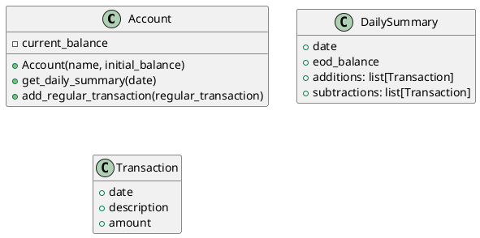

```plantuml
@startuml
hide empty members

class Account {
    - current_balance

    + Account(name, initial_balance)
    + get_daily_summary(date)
    + add_regular_transaction(regular_transaction)
}

class DailySummary {
    + date
    + eod_balance
    + additions: list[Transaction]
    + subtractions: list[Transaction]

}

class Transaction {
    + date
    + description
    + amount
}

@enduml
```